# Neural-Pokemon-Evolution

A project to "evolve" images of Pokemon using pix2pix, and their names using a char-level seq2seq model. The goal is to make predictions for the new Sword and Shield starters, then see how well I did when their evolved forms are released.

The predicted names are:

Sobble &rarr; Grobtil &rarr; Golodod

Scorbunny &rarr; Honun &rarr;  Sullox

Grookey &rarr; Bolodom &rarr;  Giglilic

I'm not happy with the quality of the predicted "evolved form" images as they are now: they're smeary and even with lots of training and in the best cases they end up looking like something out of _The Fly_. But just so you can see that this is in fact an exectuted-upon part of the project, the predictions for the new starters are below. Note that I still have to re-run the process on the second-evolution output forms, so those aren't available for the moment:

Sobble | Grobtil | Golodod
:-------------------------:|:-------------------------:|:-------------------------:
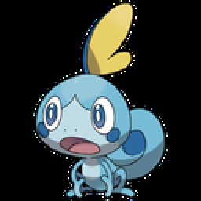 | 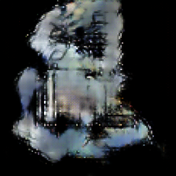| ???

Scorbunny | Honun | Sullox
:-------------------------:|:-------------------------:|:-------------------------:
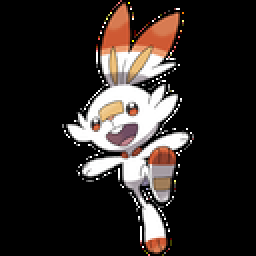 | 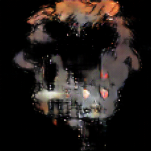| ???

Grookey | Bolodum | Giglilic
:-------------------------:|:-------------------------:|:-------------------------:
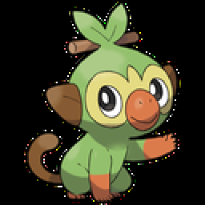  |  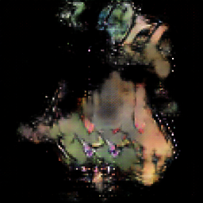| ???

And some cherry-picked examples from the test-set where it doesn't look like the network just put its hands inside the poor wee beasties and twisted its fingers around:

Meowth | Persian Target | Persian Prediction
:-------------------------:|:-------------------------:|:-------------------------:
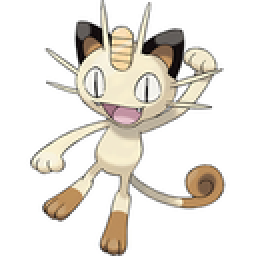 | 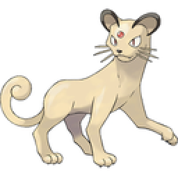| 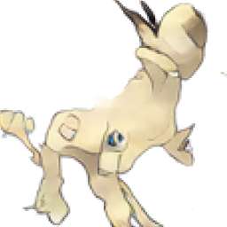

Ratata | Raticate Target | Raticate Prediction
:-------------------------:|:-------------------------:|:-------------------------:
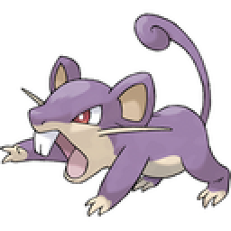 | 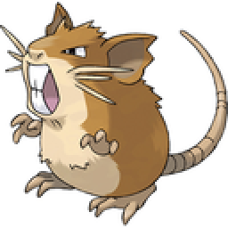| 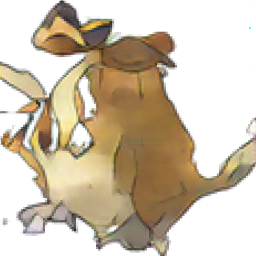
